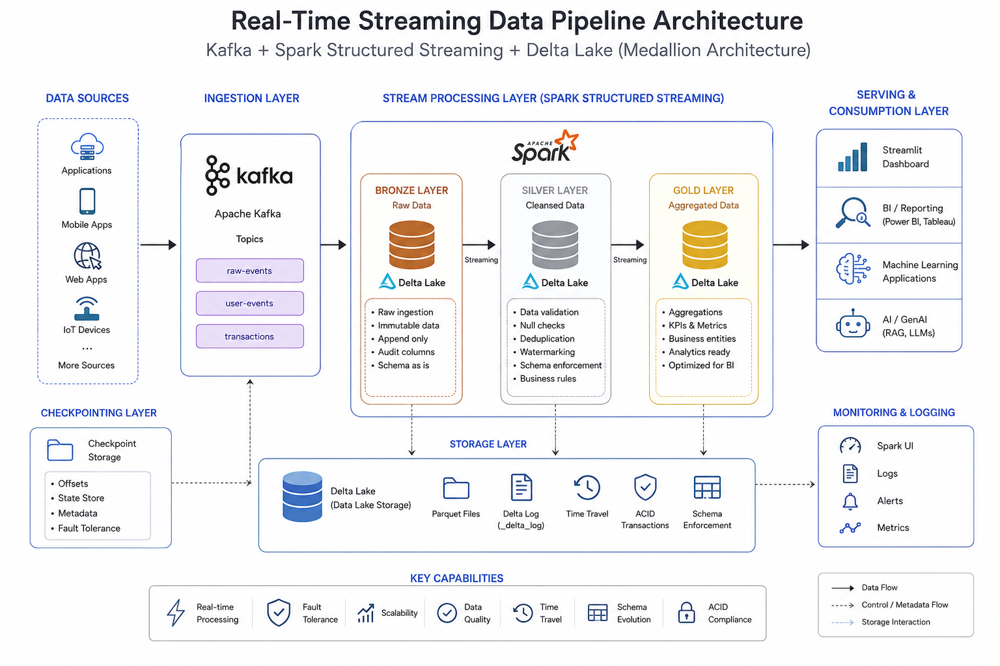

# Real-Time Streaming Data Pipeline using Apache Spark, Kafka & Delta Lake



## Overview

This project implements an end-to-end **real-time data engineering platform** using modern lakehouse architecture principles.

The pipeline ingests real-time events through **Apache Kafka**, processes them using **Apache Spark Structured Streaming**, stores data using **Delta Lake**, and organizes the data using a production-grade **Medallion Architecture (Bronze, Silver, Gold)**.

The objective of this project is to demonstrate how large-scale streaming systems are designed for:

- Reliable event ingestion
- Incremental data processing
- Data quality enforcement
- Stateful streaming operations
- Fault-tolerant processing
- Analytics-ready data modeling
- AI-ready data preparation

---

# Architecture

```
                         Event Producers
                               |
                               |
                               v
                        Apache Kafka
                               |
                               |
                               v
                  Spark Structured Streaming
                               |
                               |
                 +-------------+-------------+
                 |                           |
                 v                           v

            Bronze Layer               Checkpoint
            Delta Lake                  Storage

        Raw immutable events
                 |
                 |
                 v

            Silver Layer
            Delta Lake

        Data Cleaning
        Schema Validation
        Null Checks
        Deduplication
        Watermarking
        Business Rules

                 |
                 |
                 v

             Gold Layer
             Delta Lake

        Business Aggregations
        Analytics Tables
        Reporting Layer

                 |
                 |
                 v

          Streamlit Dashboard
```

---

# Technology Stack

| Technology | Purpose |
|---|---|
| Apache Kafka | Real-time event ingestion |
| Apache Spark Structured Streaming | Distributed stream processing |
| Delta Lake | ACID lakehouse storage |
| PySpark | Data transformation framework |
| Python | Pipeline development |
| SQL | Data analysis and transformations |
| Streamlit | Data visualization |
| Git | Version control |

---

# Key Engineering Concepts Implemented

## 1. Real-Time Event Streaming

The pipeline consumes continuously arriving events from Kafka.

Example flow:

```
Producer
   |
   |
Kafka Topic
   |
   |
Spark Streaming Consumer
   |
   |
Delta Lake
```

Spark Structured Streaming processes data using micro-batches while maintaining fault tolerance using checkpoints.

---

# Medallion Architecture

## Bronze Layer - Raw Data Ingestion

Purpose:

Store raw incoming events exactly as received.

Responsibilities:

- Kafka ingestion
- Raw event preservation
- Append-only storage
- Schema capture
- Audit columns

Example columns:

```
event_id
event_type
event_date
```

Design principles:

- No business transformations
- No data cleaning
- Full historical preservation


---

## Silver Layer - Cleansed Data

The Silver layer creates trusted datasets.

Implemented operations:

### Schema Validation

Ensures incoming data follows expected structure.

---

### Data Quality Checks

Examples:

- Required fields cannot be NULL
- Invalid records separated
- Data type validation


---

### Deduplication

Duplicate events are removed using:

```
event_id
```

with streaming state management.

Example:

```
Before:

event_id
---------
101
101
102


After:

event_id
---------
101
102
```

---

### Watermarking

Watermarks are applied to manage late-arriving events and control streaming state.

Example:

```python
.withWatermark(
    "event_time",
    "10 minutes"
)
```

This prevents unlimited state growth while allowing late data arrival.

---

# Gold Layer - Analytics Layer

The Gold layer contains business-ready datasets.

Responsibilities:

- Aggregations
- KPIs
- Reporting tables
- Dashboard consumption

Examples:

```
Daily Transaction Metrics

event_count
```

The Gold layer is optimized for:

- BI dashboards
- Reporting
- Machine learning feature generation
- AI applications

---

# Delta Lake Design

Delta Lake provides:

## ACID Transactions

Ensures reliable concurrent reads and writes.

---

## Transaction Log

Each table maintains:

```
_delta_log
```

which tracks:

- commits
- schema changes
- file additions/removals


---

## Streaming Reads

Silver and Gold consume upstream Delta tables using:

```python
spark.readStream \
.format("delta") \
.load(path)
```

This enables incremental processing instead of repeatedly scanning full datasets.

---

# Fault Tolerance

Every streaming job uses checkpoints.

Example:

```
checkpoints/

    bronze_checkpoint/

    silver_checkpoint/

    gold_checkpoint/
```

Checkpoints maintain:

- processed offsets
- streaming state
- recovery information

If a job fails, Spark resumes from the last successful checkpoint.

---

# Project Structure

```
Real-time-Streaming-Pipeline

│
├── spark
│   |
│   ├── bronze
│   │    └── bronze_spark.py
│   |
│   ├── silver
│   │    └── silver_spark.py
│   |
│   └── gold
│        └── gold_spark.py
│
├── utils
│   |
│   ├── delta_table_helper_function.py
│   └── logger.py
│
├── data
│
├── checkpoints
│
├── data_visualisation
│   |
│   └── streamlit_viewer.py
│
└── README.md
```

---

# Running the Project

## Prerequisites

Install:

- Java 17
- Apache Spark 3.5+
- Python 3.11+
- Kafka
- Delta Lake


---

# Start Bronze Streaming Job

```bash
spark-submit \
spark/bronze/bronze_spark.py
```

---

# Start Silver Streaming Job

```bash
spark-submit \
spark/silver/silver_spark.py
```

---

# Start Gold Streaming Job

```bash
spark-submit \
spark/gold/gold_spark.py
```

---

# Data Visualization

The Gold layer can be consumed by Streamlit.

Run:

```bash
streamlit run data_visualisation/streamlit_viewer.py
```

---

# Engineering Decisions

## Why Kafka?

Kafka provides:

- High-throughput ingestion
- Durable event storage
- Decoupling producers and consumers
- Scalable event processing


---

## Why Spark Structured Streaming?

Spark provides:

- Distributed processing
- Stateful transformations
- Exactly-once processing guarantees
- Integration with Delta Lake


---

## Why Delta Lake?

Traditional data lakes using only Parquet have problems:

- No ACID transactions
- Difficult updates
- No reliable streaming reads

Delta Lake provides:

- Transaction consistency
- Schema enforcement
- Time travel
- Streaming support

---

# Future Enhancements

## AI Ready Data Platform

The next evolution of this platform is adding AI capabilities:

```
Gold Layer
      |
      |
Feature Engineering
      |
      |
Embedding Generation
      |
      |
Vector Database
      |
      |
RAG Applications
```

Potential additions:

- Document ingestion pipelines
- Vector embeddings
- Retrieval Augmented Generation (RAG)
- AI search layer
- Metadata enrichment

---

# Production Improvements

Future production deployment:

- Deploy Spark jobs on Databricks
- Use Azure Data Lake Storage
- Add Azure Data Factory orchestration
- Add monitoring with Prometheus/Grafana
- Add CI/CD using GitHub Actions
- Add automated data quality framework


---

# Skills Demonstrated

This project demonstrates practical experience with:

- Distributed systems
- Streaming architectures
- Lakehouse design
- Apache Spark internals
- Delta Lake
- Kafka event-driven systems
- Data quality engineering
- Scalable ETL design
- AI-ready data pipelines


---

# Author

## Abdullah Aleem

Data Engineer focused on building scalable data platforms and AI-ready data pipelines.

GitHub:
https://github.com/abdullah-aleem
